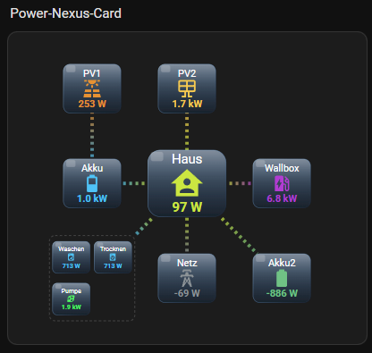
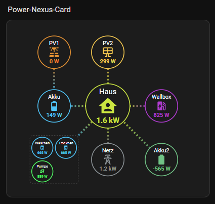
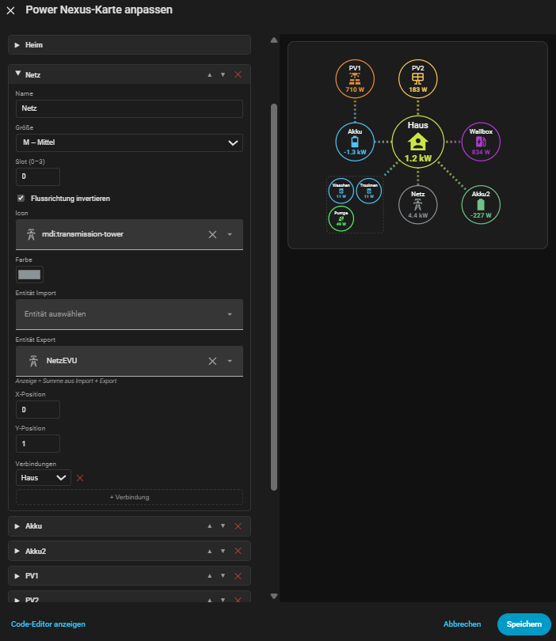
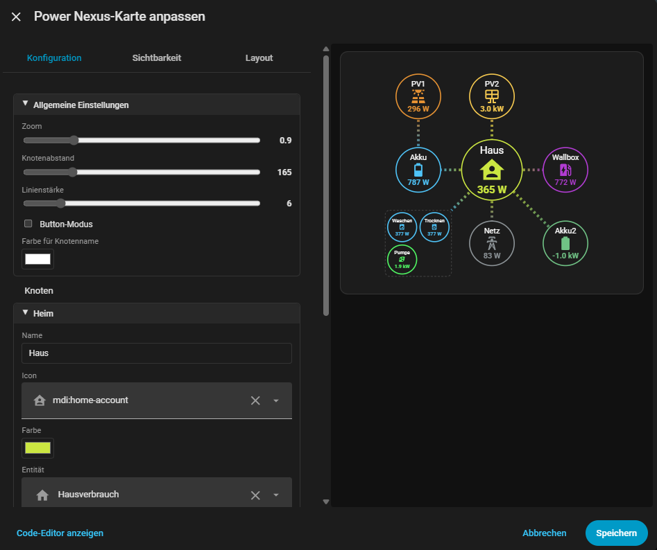
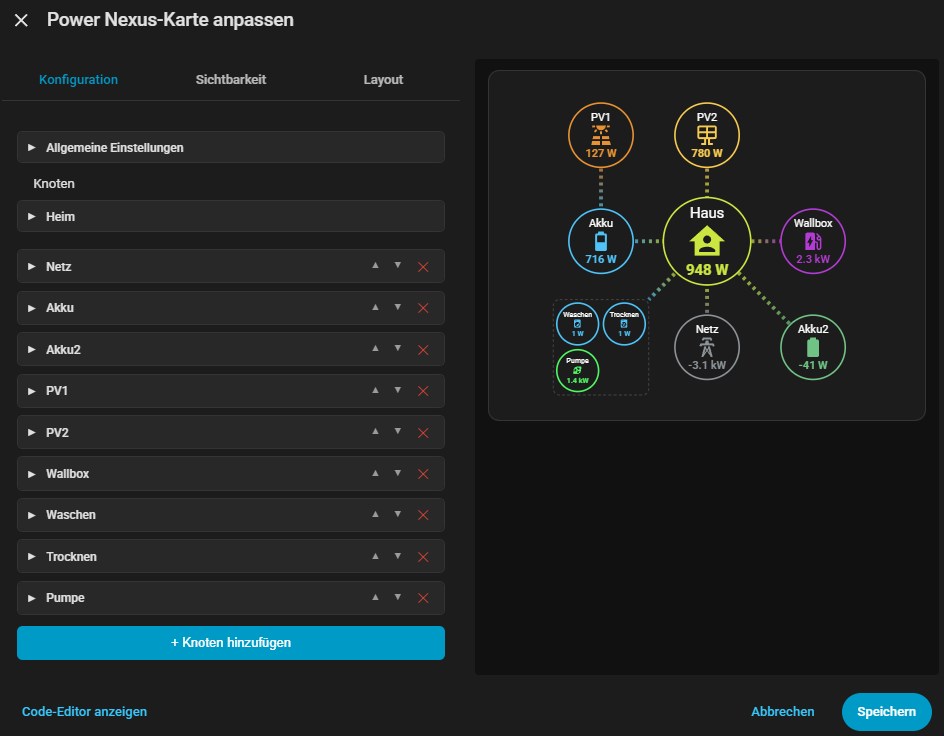

# Power Nexus Card

**v0.2.046** – Home Assistant Lovelace Custom Card

Please support my work:

[](https://ko-fi.com/mankiesworkshop)

MANY THANKS!

---

## 🇩🇪 Deutsch

### Beschreibung

Die Power Nexus Card ist eine Custom Card für Home Assistant zur Visualisierung von Energieflüssen. Im Zentrum steht ein frei definierbares Energiesystem mit einem zentralen Haus-Knoten (Nexus), um den beliebig viele Energiequellen und Verbraucher angeordnet werden.

- gesamter Karteninhalt individuell zoombar
- frei konfigurierbare Knoten (PV, Batterie, Netz, Verbraucher …)
- drei Grössenstufen (S / M / L) für die Knoten
- Knotenposition und Knotenabstand frei wählbar
- Knoten zu Gruppen zusammenfassbar
- frei anpassbare Flusslinien (Größe, Richtung)
- dynamische Sichtbarkeit (Schwellwert-basiert) der Knoten und Flusslinien
- responsives Grid-Layout für Section Dashboards
- zusätzlicher "Buttonmodus" (optische Varianz) wählbar
- Ladestände grafisch darstellbar
- Wahl zwischen einer Gesamt-Entität oder zwei Einzel-Entitäten für Input und Output
- GUI-Editor zur Konfiguration
- Aktueller Sprachsupport: DE & EN

### Installation

#### HACS

1. HACS → ⋮ Menü → **Custom repositories**
2. URL: `https://github.com/MankiesWorkshop/power-nexus-card`
3. Typ: **Lovelace** → **Add**
4. Karte in HACS suchen und installieren

#### Manuell

1. `power-nexus-card.js` in dein `config/www/`-Verzeichnis kopieren
2. In der Lovelace-Ressourcenliste hinzufügen:

```yaml
url: /local/power-nexus-card.js
type: module
```

### Minimalkonfiguration

```yaml
type: custom:power-nexus-card
nodes:
  - name: PV
    icon: mdi:solar-power
    size: L
    color: "#ffab40"
    entity: sensor.pv_power
    x: -1
    y: 0
    connections:
      - target: home
  - name: Netz
    icon: mdi:transmission-tower
    size: L
    color: "#66bb6a"
    entity: sensor.grid_power
    x: 0
    y: 1
    connections:
      - target: home
  - name: Waschmaschine
    icon: mdi:washing-machine
    size: S
    entity: sensor.washing_machine_power
    auto_hide: true
    hide_threshold: 10
    hide_mode: hide
```

### Node-Eigenschaften

| Eigenschaft | Typ | Default | Beschreibung |
|---|---|---|---|
| `name` | string | `""` | Anzeigename |
| `icon` | string | `""` | MDI-Icon (z.B. `mdi:solar-power`) |
| `color` | string | `"#4fc3f7"` | Knotenfarbe (Hex) |
| `size` | string | `"M"` | `S`, `M` oder `L` |
| `entity` | string | `""` | Entität Import (Leistungswert, signed) |
| `entity2` | string | `""` | Entität Export (Leistungswert, signed) |
| `soc_entity` | string | `""` | Entität für Ladestand (SoC) |
| `slot` | number | `0` | Slot-Position (0–3) |
| `x` | number | `-1` | X-Position im Grid |
| `y` | number | `0` | Y-Position im Grid |
| `invert_flow` | boolean | `false` | Flussrichtung umkehren |
| `auto_hide` | boolean | `false` | Automatisches Ausblenden |
| `hide_threshold` | number | `0` | Schwellwert Ausblenden (Watt) |
| `hide_mode` | string | `"hide"` | Ausblendmodus: `hide` oder `fade` |
| `connections` | array | `[]` | Verbindungen (z.B. `[{ target: "home" }]`) |

---

## 🇬🇧 English

### Description

Power Nexus Card is a custom Lovelace card for Home Assistant that visualizes energy flows. At its center is a freely definable energy system with a central house node (Nexus), around which any number of energy sources and consumers can be arranged.

- Entire card content individually zoomable
- Freely configurable nodes (PV, battery, grid, appliances …)
- Three size levels (S / M / L) for the nodes
- Node position and spacing freely adjustable
- Nodes can be grouped together
- Freely adjustable flow lines (size, direction)
- Dynamic visibility (threshold-based) for nodes and flow lines
- Responsive grid layout for section dashboards
- Additional "button mode" (visual variety) selectable
- State of charge displayable as graphic
- Choice between one combined entity or two separate entities for input and output
- GUI editor for configuration
- Current language support: DE & EN

### Installation

#### HACS

1. HACS → ⋮ Menu → **Custom repositories**
2. URL: `https://github.com/MankiesWorkshop/power-nexus-card`
3. Type: **Lovelace** → **Add**
4. Find the card in HACS and install

#### Manual

1. Copy `power-nexus-card.js` into your `config/www/` directory
2. Add to your Lovelace resource list:

```yaml
url: /local/power-nexus-card.js
type: module
```

### Minimal Configuration

```yaml
type: custom:power-nexus-card
nodes:
  - name: PV
    icon: mdi:solar-power
    size: L
    color: "#ffab40"
    entity: sensor.pv_power
    x: -1
    y: 0
    connections:
      - target: home
  - name: Grid
    icon: mdi:transmission-tower
    size: L
    color: "#66bb6a"
    entity: sensor.grid_power
    x: 0
    y: 1
    connections:
      - target: home
  - name: Washing Machine
    icon: mdi:washing-machine
    size: S
    entity: sensor.washing_machine_power
    auto_hide: true
    hide_threshold: 10
    hide_mode: hide
```

### Node Properties

| Property | Type | Default | Description |
|---|---|---|---|
| `name` | string | `""` | Display name |
| `icon` | string | `""` | MDI icon (e.g. `mdi:solar-power`) |
| `color` | string | `"#4fc3f7"` | Node color (hex) |
| `size` | string | `"M"` | `S`, `M` or `L` |
| `entity` | string | `""` | Import entity (power value, signed) |
| `entity2` | string | `""` | Export entity (power value, signed) |
| `soc_entity` | string | `""` | Entity for state of charge (SoC) |
| `slot` | number | `0` | Slot position (0–3) |
| `x` | number | `-1` | X position in grid |
| `y` | number | `0` | Y position in grid |
| `invert_flow` | boolean | `false` | Reverse flow direction |
| `auto_hide` | boolean | `false` | Auto-hide node |
| `hide_threshold` | number | `0` | Hide threshold (watts) |
| `hide_mode` | string | `"hide"` | Hide mode: `hide` or `fade` |
| `connections` | array | `[]` | Connections (e.g. `[{ target: "home" }]`) |

---

## 🇨🇳 中文

### 描述

Power Nexus Card 是一款用于 Home Assistant 的自定义 Lovelace 卡片，用于可视化能源流动。其核心是一个可自由定义的能源系统，以中央房屋节点（Nexus）为中心，可围绕其排列任意数量的能源来源和消耗者。

- 整个卡片内容可单独缩放
- 可自由配置的节点（光伏、电池、电网、用电器 …）
- 三种节点尺寸等级（S / M / L）
- 节点位置和间距可自由调整
- 可将节点合并为组
- 可自由调整的流向线（大小、方向）
- 节点和流向线的动态可见性（基于阈值）
- 适用于 Section Dashboard 的响应式网格布局
- 可选的"按钮模式"（视觉多样化）
- 可图形化显示充电状态
- 可选择使用一个综合实体或两个独立实体用于输入和输出
- 用于配置的 GUI 编辑器
- 当前语言支持：德语和英语

### 安装

#### HACS

1. HACS → ⋮ 菜单 → **Custom repositories**
2. URL：`https://github.com/MankiesWorkshop/power-nexus-card`
3. 类型：**Lovelace** → **Add**
4. 在 HACS 中搜索卡片并安装

#### 手动

1. 将 `power-nexus-card.js` 复制到你的 `config/www/` 目录
2. 添加到 Lovelace 资源列表：

```yaml
url: /local/power-nexus-card.js
type: module
```

### 最小配置

```yaml
type: custom:power-nexus-card
nodes:
  - name: PV
    icon: mdi:solar-power
    size: L
    color: "#ffab40"
    entity: sensor.pv_power
    x: -1
    y: 0
    connections:
      - target: home
  - name: Grid
    icon: mdi:transmission-tower
    size: L
    color: "#66bb6a"
    entity: sensor.grid_power
    x: 0
    y: 1
    connections:
      - target: home
  - name: Washing Machine
    icon: mdi:washing-machine
    size: S
    entity: sensor.washing_machine_power
    auto_hide: true
    hide_threshold: 10
    hide_mode: hide
```

### 节点属性

| 属性 | 类型 | 默认值 | 描述 |
|---|---|---|---|
| `name` | string | `""` | 显示名称 |
| `icon` | string | `""` | MDI 图标（例如 `mdi:solar-power`） |
| `color` | string | `"#4fc3f7"` | 节点颜色（十六进制） |
| `size` | string | `"M"` | `S`、`M` 或 `L` |
| `entity` | string | `""` | 输入实体（功率值，带符号） |
| `entity2` | string | `""` | 输出实体（功率值，带符号） |
| `soc_entity` | string | `""` | 充电状态实体（SoC） |
| `slot` | number | `0` | 插槽位置（0–3） |
| `x` | number | `-1` | 网格中的 X 坐标 |
| `y` | number | `0` | 网格中的 Y 坐标 |
| `invert_flow` | boolean | `false` | 反转流向 |
| `auto_hide` | boolean | `false` | 自动隐藏节点 |
| `hide_threshold` | number | `0` | 隐藏阈值（瓦特） |
| `hide_mode` | string | `"hide"` | 隐藏模式：`hide` 或 `fade` |
| `connections` | array | `[]` | 连接（例如 `[{ target: "home" }]`） |

---

## Screenshots







## Lizenz / License

MIT
