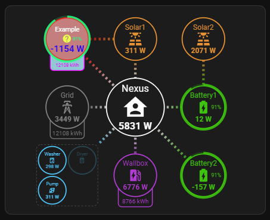
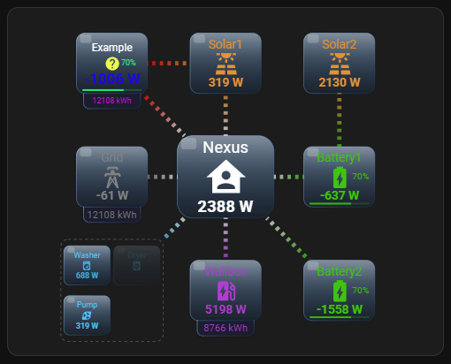
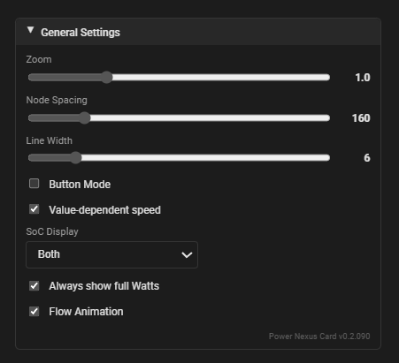
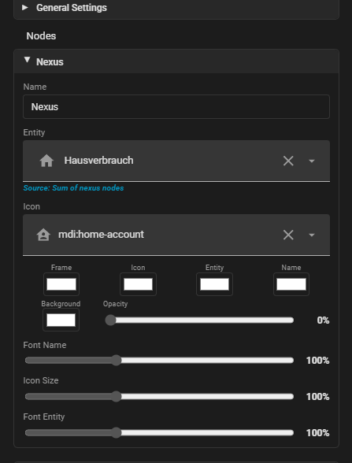
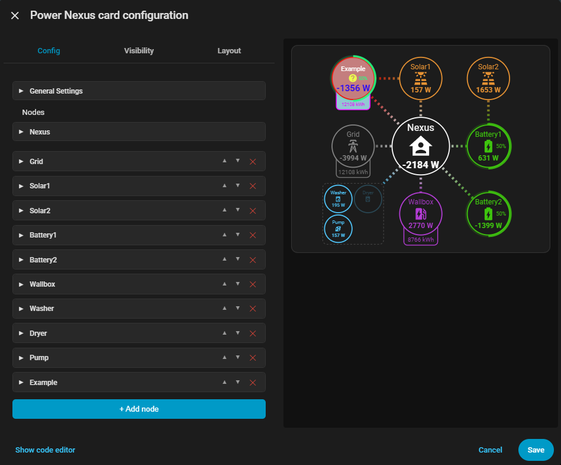
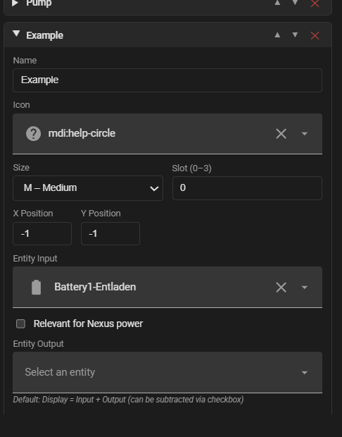
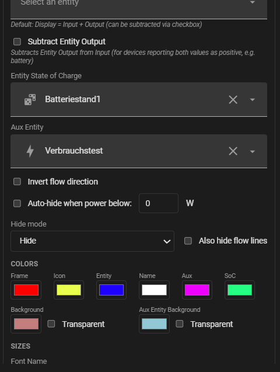
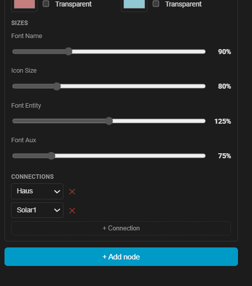
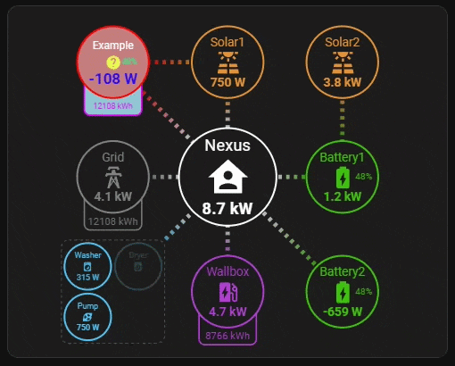
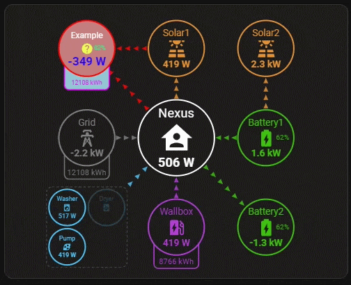

# Power Nexus Card

Home Assistant Lovelace Custom Card

Please support my work:

[](https://ko-fi.com/mankiesworkshop)

MANY THANKS!

---

## 🇩🇪 Deutsch

Hallo zusammen!

Ich möchte Euch gern meine Power Nexus Card für Home Assistant vorstellen.
Warum noch eine? Ich habe verschiedene Power-Flow-Karten ausprobiert, aber keine hatte alle Anpassungsmöglichkeiten, die ich wollte. Meistens passten die grafischen Details nicht zu meinen Vorstellungen oder es fehlten mir irgendwelche Details. Außerdem sind einige der anderen Cards nicht mehr in Weiterentwicklung und Feature-Requests verlaufen im Sande.

Ihr findet sie unter:

https://github.com/MankiesWorkshop/power-nexus-card

### Beschreibung

Die Power Nexus Card ist eine Custom Card für Home Assistant zur Visualisierung von Energieflüssen. Im Zentrum steht ein frei definierbares Energiesystem mit einem zentralen Haus-Knoten (Nexus), um den beliebig viele Energiequellen und Verbraucher angeordnet werden.

- vollständig im GUI-Editor intuitiv konfigurierbar
- gesamter Karteninhalt individuell zoombar
- frei konfigurierbare Knoten (PV, Batterie, Netz, Verbraucher …)
- drei Grössenstufen (S / M / L) für die Knoten
- Knotenposition und Knotenabstand frei wählbar
- Knoten zu Gruppen zusammenfassbar
- Layout der Knoten komplett individualisierbar (Farben, Icongröße, Hintergrund, Schriftgröße)
- frei anpassbare Flusslinien (Größe, Richtung, Animation)
- dynamische Sichtbarkeit (Schwellwert-basiert) der Knoten und Flusslinien
- responsives Grid-Layout für Section Dashboards
- zusätzlicher "Buttonmodus" (anderes Aussehen) wählbar
- Ladestände grafisch oder per Text oder beides darstellbar
- optional Umrechnung der Watt in Kilowattwerte
- Nexus (Home)-Knoten nutzt entweder eine Entität oder die SUmme aus markierten Knoten
- Wahl zwischen einer Gesamt-Entität oder zwei Einzel-Entitäten für Input und Output
- zusätzlich anzeigebare Entität pro Knoten (bspw. für Tagesverbräuche)
- Aktueller Sprachsupport im GUI-Editor: DE & EN

### Installation

#### HACS

1. HACS → ⋮ Menü → **Custom repositories**
2. URL: `https://github.com/MankiesWorkshop/power-nexus-card`
3. Typ: **Lovelace** → **Add**
4. Karte in HACS suchen und installieren

#### Manuell

1. `power-nexus-card.js` in dein `config/www/`-Verzeichnis kopieren
2. In der Lovelace-Ressourcenliste hinzufügen:

```yaml
url: /local/power-nexus-card.js
type: module
```

### Minimalkonfiguration

```yaml
type: custom:power-nexus-card
nodes:
  - name: PV
    icon: mdi:solar-power
    size: L
    color: "#ffab40"
    entity: sensor.pv_power
    x: -1
    y: 0
    connections:
      - target: home
  - name: Netz
    icon: mdi:transmission-tower
    size: L
    color: "#66bb6a"
    entity: sensor.grid_power
    x: 0
    y: 1
    connections:
      - target: home
  - name: Waschmaschine
    icon: mdi:washing-machine
    size: S
    entity: sensor.washing_machine_power
    auto_hide: true
    hide_threshold: 10
    hide_mode: hide
```

### Node-Eigenschaften

| Eigenschaft | Typ | Default | Beschreibung |
|---|---|---|---|
| `name` | string | `""` | Anzeigename |
| `icon` | string | `""` | MDI-Icon (z.B. `mdi:solar-power`) |
| `color` | string | `"#4fc3f7"` | Rahmenfarbe (Hex) |
| `size` | string | `"M"` | `S`, `M` oder `L` |
| `entity` | string | `""` | Entität Input (Leistungswert, signed) |
| `entity2` | string | `""` | Entität Output (Leistungswert, signed) |
| `subtract_output` | boolean | `false` | Entität Output subtrahieren |
| `soc_entity` | string | `""` | Entität für Ladestand (SoC) |
| `aux_entity` | string | `""` | Zusatz-Entität (z.B. Tagesverbrauch) |
| `nexus_relevant` | boolean | `false` | Für Nexus-Leistung relevant |
| `slot` | number | `0` | Slot-Position (0–3) |
| `x` | number | `-1` | X-Position im Grid |
| `y` | number | `0` | Y-Position im Grid |
| `invert_flow` | boolean | `false` | Flussrichtung umkehren |
| `auto_hide` | boolean | `false` | Automatisch ausblenden |
| `hide_threshold` | number | `0` | Schwellwert Ausblenden (Watt) |
| `hide_mode` | string | `"hide"` | Ausblendmodus: `hide` oder `fade` |
| `fade_hide_edges` | boolean | `false` | Auch Flusslinien ausblenden |
| `bg_color` | string | `"#000000"` | Hintergrundfarbe (Hex) |
| `bg_transparent` | boolean | `false` | Hintergrund transparent |
| `icon_color` | string | `""` | Icon-Farbe (Hex) |
| `power_color` | string | `""` | Entität-Farbe (Hex) |
| `name_color` | string | `""` | Name-Farbe (Hex) |
| `aux_color` | string | `""` | Zusatz-Farbe (Hex) |
| `aux_bg_color` | string | `"#000000"` | Hintergrund Zusatzentität (Hex) |
| `aux_bg_transparent` | boolean | `false` | Zusatz-Hintergrund transparent |
| `soc_color` | string | `""` | Ladestand-Farbe (Hex) |
| `name_size` | number | `100` | Schriftgröße Name (%) |
| `icon_size` | number | `100` | Icon-Größe (%) |
| `power_size` | number | `100` | Schriftgröße Entität (%) |
| `aux_size` | number | `100` | Schriftgröße Zusatz (%) |
| `connections` | array | `[]` | Verbindungen (z.B. `[{ target: "home" }]`) |

---

## 🇬🇧 English

Hello everyone!

I'd like to introduce my Power Nexus Card for Home Assistant.
Why another one? I've tried various power flow cards, but none had all the customization options I wanted. Usually the graphical details didn't match my vision or some features were missing. Additionally, some of the other cards are no longer being developed and feature requests go unanswered.

You can find it at:

https://github.com/MankiesWorkshop/power-nexus-card

### Description

The Power Nexus Card is a custom card for Home Assistant to visualize energy flows. At its center is a freely definable energy system with a central home node (Nexus), around which any number of energy sources and consumers can be arranged.

- fully and intuitively configurable via GUI editor
- entire card content individually zoomable
- freely configurable nodes (PV, battery, grid, consumers …)
- three size levels (S / M / L) for nodes
- node position and spacing freely selectable
- nodes can be grouped together
- node layout fully customizable (colors, icon size, background, font size)
- freely adjustable flow lines (size, direction, animation)
- dynamic visibility (threshold-based) of nodes and flow lines
- responsive grid layout for section dashboards
- additional "button mode" (different appearance) selectable
- state of charge displayable graphically, as text, or both
- optional conversion of watts to kilowatts
- Nexus (Home) node uses either an entity or the sum of marked nodes
- choice between a total entity or two individual entities for input and output
- additional displayable entity per node (e.g. for daily consumption)
- current language support in the GUI editor: DE & EN

### Installation

#### HACS

1. HACS → ⋮ Menu → **Custom repositories**
2. URL: `https://github.com/MankiesWorkshop/power-nexus-card`
3. Type: **Lovelace** → **Add**
4. Find the card in HACS and install

#### Manual

1. Copy `power-nexus-card.js` to your `config/www/` directory
2. Add to your Lovelace resource list:

```yaml
url: /local/power-nexus-card.js
type: module
```

### Minimal Configuration

```yaml
type: custom:power-nexus-card
nodes:
  - name: PV
    icon: mdi:solar-power
    size: L
    color: "#ffab40"
    entity: sensor.pv_power
    x: -1
    y: 0
    connections:
      - target: home
  - name: Grid
    icon: mdi:transmission-tower
    size: L
    color: "#66bb6a"
    entity: sensor.grid_power
    x: 0
    y: 1
    connections:
      - target: home
  - name: Washing Machine
    icon: mdi:washing-machine
    size: S
    entity: sensor.washing_machine_power
    auto_hide: true
    hide_threshold: 10
    hide_mode: hide
```

### Node Properties

| Property | Type | Default | Description |
|---|---|---|---|
| `name` | string | `""` | Display name |
| `icon` | string | `""` | MDI icon (e.g. `mdi:solar-power`) |
| `color` | string | `"#4fc3f7"` | Frame color (Hex) |
| `size` | string | `"M"` | `S`, `M` or `L` |
| `entity` | string | `""` | Entity Input (power value, signed) |
| `entity2` | string | `""` | Entity Output (power value, signed) |
| `subtract_output` | boolean | `false` | Subtract Entity Output |
| `soc_entity` | string | `""` | Entity for state of charge (SoC) |
| `aux_entity` | string | `""` | Auxiliary entity (e.g. daily consumption) |
| `nexus_relevant` | boolean | `false` | Relevant for Nexus power sum |
| `slot` | number | `0` | Slot position (0–3) |
| `x` | number | `-1` | X position in grid |
| `y` | number | `0` | Y position in grid |
| `invert_flow` | boolean | `false` | Invert flow direction |
| `auto_hide` | boolean | `false` | Auto-hide |
| `hide_threshold` | number | `0` | Hide threshold (Watts) |
| `hide_mode` | string | `"hide"` | Hide mode: `hide` or `fade` |
| `fade_hide_edges` | boolean | `false` | Also hide flow lines |
| `bg_color` | string | `"#000000"` | Background color (Hex) |
| `bg_transparent` | boolean | `false` | Background transparent |
| `icon_color` | string | `""` | Icon color (Hex) |
| `power_color` | string | `""` | Entity color (Hex) |
| `name_color` | string | `""` | Name color (Hex) |
| `aux_color` | string | `""` | Aux color (Hex) |
| `aux_bg_color` | string | `"#000000"` | Aux entity background (Hex) |
| `aux_bg_transparent` | boolean | `false` | Aux background transparent |
| `soc_color` | string | `""` | SoC color (Hex) |
| `name_size` | number | `100` | Font size Name (%) |
| `icon_size` | number | `100` | Icon size (%) |
| `power_size` | number | `100` | Font size Entity (%) |
| `aux_size` | number | `100` | Font size Aux (%) |
| `connections` | array | `[]` | Connections (e.g. `[{ target: "home" }]`) |

---

## 🇨🇳 中文

大家好！

我想向大家介绍我的 Home Assistant Power Nexus Card。
为什么又做一个？我尝试过各种能源流卡片，但没有一个具备我想要的全部自定义选项。通常图形细节不符合我的设想，或者缺少某些功能。此外，一些其他卡片已不再维护，功能请求也石沉大海。

你可以在以下地址找到它：

https://github.com/MankiesWorkshop/power-nexus-card

### 描述

Power Nexus Card 是一款用于 Home Assistant 的自定义卡片，用于可视化能源流。其核心是一个可自由定义的能源系统，以中央家庭节点（Nexus）为中心，可围绕其布置任意数量的能源来源和消费者。

- 可通过 GUI 编辑器直观地完全配置
- 整个卡片内容可单独缩放
- 可自由配置的节点（光伏、电池、电网、用电器等）
- 三种尺寸级别（S / M / L）
- 节点位置和间距可自由选择
- 节点可分组
- 节点布局完全可定制（颜色、图标大小、背景、字体大小）
- 可自由调整的流线（大小、方向、动画）
- 节点和流线的动态可见性（基于阈值）
- 适用于分区仪表板的响应式网格布局
- 可选的"按钮模式"（不同外观）
- 荷电状态可以图形、文字或两者同时显示
- 可选将瓦特转换为千瓦
- Nexus（家庭）节点可使用一个实体或标记节点的总和
- 可选择使用一个总实体或两个单独的输入/输出实体
- 每个节点可额外显示一个实体（例如日消耗量）
- GUI 编辑器中的当前语言支持：德语和英语

### 安装

#### HACS

1. HACS → ⋮ 菜单 → **自定义仓库**
2. URL: `https://github.com/MankiesWorkshop/power-nexus-card`
3. 类型: **Lovelace** → **添加**
4. 在 HACS 中搜索并安装卡片

#### 手动

1. 将 `power-nexus-card.js` 复制到 `config/www/` 目录
2. 添加到 Lovelace 资源列表：

```yaml
url: /local/power-nexus-card.js
type: module
```

### 最小配置

```yaml
type: custom:power-nexus-card
nodes:
  - name: PV
    icon: mdi:solar-power
    size: L
    color: "#ffab40"
    entity: sensor.pv_power
    x: -1
    y: 0
    connections:
      - target: home
  - name: 电网
    icon: mdi:transmission-tower
    size: L
    color: "#66bb6a"
    entity: sensor.grid_power
    x: 0
    y: 1
    connections:
      - target: home
  - name: 洗衣机
    icon: mdi:washing-machine
    size: S
    entity: sensor.washing_machine_power
    auto_hide: true
    hide_threshold: 10
    hide_mode: hide
```

### 节点属性

| 属性 | 类型 | 默认值 | 描述 |
|---|---|---|---|
| `name` | string | `""` | 显示名称 |
| `icon` | string | `""` | MDI 图标 (例如 `mdi:solar-power`) |
| `color` | string | `"#4fc3f7"` | 边框颜色 (Hex) |
| `size` | string | `"M"` | `S`、`M` 或 `L` |
| `entity` | string | `""` | 输入实体（功率值，有符号） |
| `entity2` | string | `""` | 输出实体（功率值，有符号） |
| `subtract_output` | boolean | `false` | 减去输出实体 |
| `soc_entity` | string | `""` | 荷电状态实体 (SoC) |
| `aux_entity` | string | `""` | 辅助实体（例如日消耗量） |
| `nexus_relevant` | boolean | `false` | 计入 Nexus 功率总和 |
| `slot` | number | `0` | 槽位 (0–3) |
| `x` | number | `-1` | 网格中 X 位置 |
| `y` | number | `0` | 网格中 Y 位置 |
| `invert_flow` | boolean | `false` | 反转流向 |
| `auto_hide` | boolean | `false` | 自动隐藏 |
| `hide_threshold` | number | `0` | 隐藏阈值 (瓦特) |
| `hide_mode` | string | `"hide"` | 隐藏模式: `hide` 或 `fade` |
| `fade_hide_edges` | boolean | `false` | 同时隐藏流线 |
| `bg_color` | string | `"#000000"` | 背景颜色 (Hex) |
| `bg_transparent` | boolean | `false` | 背景透明 |
| `icon_color` | string | `""` | 图标颜色 (Hex) |
| `power_color` | string | `""` | 实体颜色 (Hex) |
| `name_color` | string | `""` | 名称颜色 (Hex) |
| `aux_color` | string | `""` | 辅助颜色 (Hex) |
| `aux_bg_color` | string | `"#000000"` | 辅助实体背景 (Hex) |
| `aux_bg_transparent` | boolean | `false` | 辅助背景透明 |
| `soc_color` | string | `""` | 荷电状态颜色 (Hex) |
| `name_size` | number | `100` | 名称字体大小 (%) |
| `icon_size` | number | `100` | 图标大小 (%) |
| `power_size` | number | `100` | 实体字体大小 (%) |
| `aux_size` | number | `100` | 辅助字体大小 (%) |
| `connections` | array | `[]` | 连接 (例如 `[{ target: "home" }]`) |


## Screenshots










### Animation




## Lizenz / License

MIT
